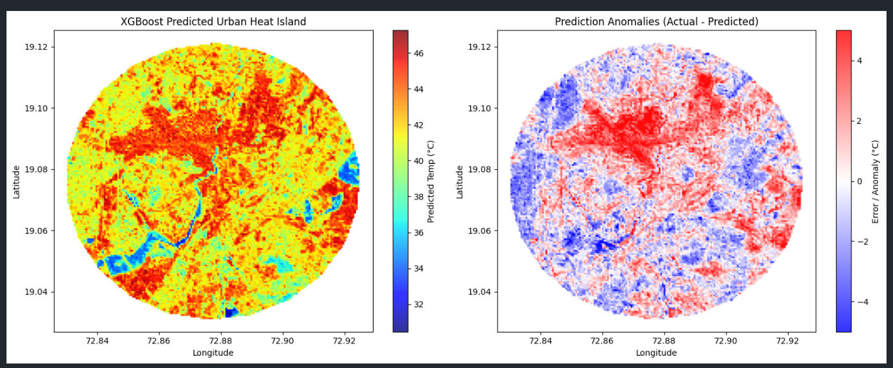
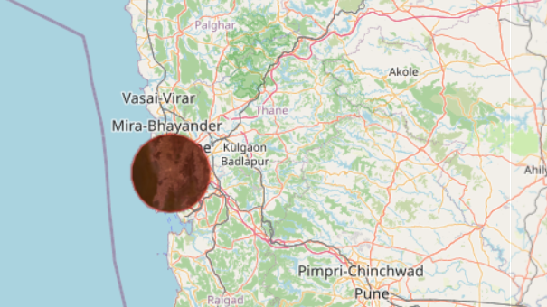

# Urban Heat Island (UHI) Prediction using Machine Learning for Mumbai



An end-to-end geospatial machine learning pipeline that extracts Landsat 8 satellite imagery, engineers spectral indices, and trains gradient-boosted regression models to predict continuous Land Surface Temperature (LST) and isolate microclimate anomalies across urban landscapes.

---

## 📌 Project Overview

Traditional Urban Heat Island (UHI) studies rely primarily on descriptive thermal mapping. This project frames UHI analysis as a predictive regression problem:

1. **Feature Extraction:** Extracts spectral indices (NDVI for vegetation, NDBI for built-up density) and thermal data via the **Google Earth Engine (GEE)** Python API.
2. **Tabular Conversion:** Translates multi-band Earth Observation rasters into structured tabular datasets.
3. **Predictive Modeling:** Trains and evaluates **Random Forest** and **XGBoost** regressors to quantify how surface composition drives thermal behavior.
4. **Spatial Anomaly Mapping:** Computes prediction residuals ($\text{Actual LST} - \text{Predicted LST}$) across a dense spatial grid to detect unmodeled thermal drivers, such as industrial facilities, high-density traffic corridors, and low-ventilation zones.

---

## 🛠️ Tech Stack & Tools

* **Cloud Geospatial Engine:** Google Earth Engine (`earthengine-api`, `geemap`)
* **Data Processing:** Python, Pandas, NumPy
* **Machine Learning:** XGBoost, Scikit-Learn
* **Spatial Visualization:** Matplotlib, Leaflet / `ipyleaflet`

---

## 🛰️ Data Processing & Feature Engineering



* **Satellite Collection:** `LANDSAT/LC08/C02/T1_L2` (Tier 1 Surface Reflectance & Surface Temperature).
* **Cloud & Shadow Filtering:** Applied bitwise masking via the `QA_PIXEL` band (bits 0–4) to eliminate clouds, cirrus, and cloud shadows.
* **Feature Set:**
  * **NDVI (Normalized Difference Vegetation Index):** Measures vegetative cooling.
    $$\text{NDVI} = \frac{\text{NIR} - \text{Red}}{\text{NIR} + \text{Red}} = \frac{\text{Band 5} - \text{Band 4}}{\text{Band 5} + \text{Band 4}}$$
  * **NDBI (Normalized Difference Built-up Index):** Measures impervious and built-up concrete surfaces.
    $$\text{NDBI} = \frac{\text{SWIR} - \text{NIR}}{\text{SWIR} + \text{NIR}} = \frac{\text{Band 6} - \text{Band 5}}{\text{Band 6} + \text{Band 5}}$$
  * **Target Variable (LST):** Derived from scaled thermal band `ST_B10` and converted to degrees Celsius (°C).

---

## 📊 Model Evaluation & Benchmarks

Models were evaluated on an unseen 20% test split:

| Model | RMSE (°C) | $R^2$ Score | Status |
| :--- | :---: | :---: | :---: |
| **Random Forest Regressor** | 2.03 | 0.8923 | Baseline |
| **XGBoost Regressor** | **1.93** | **0.9023** | **Best Performer** |

### Key Takeaways:
* **High Predictive Accuracy:** The XGBoost model achieved an $R^2$ of **0.9023**, demonstrating that vegetative cover (NDVI) and built-up density (NDBI) account for over **90% of the spatial temperature variance** across the analyzed region.
* **Low Error Margin:** An RMSE of **1.93 °C** validates that standard optical indices can closely estimate continuous surface thermal distribution at a 30-meter resolution.

---

## 🗺️ Spatial Anomaly Detection

By comparing actual satellite thermal observations against the XGBoost predictions:
* **Negative Anomalies (Cooler):** Areas cooler than predicted (e.g., water bodies, vegetative patches, shaded zones).
* **Positive Anomalies (Hotter):** Localized hotspots where temperatures exceed what vegetation and concrete indices alone predict. These pinpoint localized industrial activity, metal roofing, or extreme heat retention zones requiring targeted urban cooling interventions.

---

## 📁 Repository Structure

```text
├── assets/
│   ├── cloud_mask_aoi.png
│   └── uhi_anomalies_map.png
├── data/
│   ├── uhi_training_data.csv
│   └── uhi_dense_predictions.csv
├── notebooks/
│   └── main.ipynb
├── .gitignore
├── requirements.txt
└── README.md

---

## 🚀 Getting Started

### 1. Clone the Repository
```bash
git clone https://github.com/RITIK-PRAJAPATI-A/mumbai-uhi-prediction.git
cd mumbai-uhi-prediction
```

### 2. Install Dependencies
```bash
pip install -r requirements.txt
```

### 3. Authenticate Earth Engine & Run
```bash
python -c "import ee; ee.Authenticate()"
jupyter notebook notebooks/main.ipynb
```